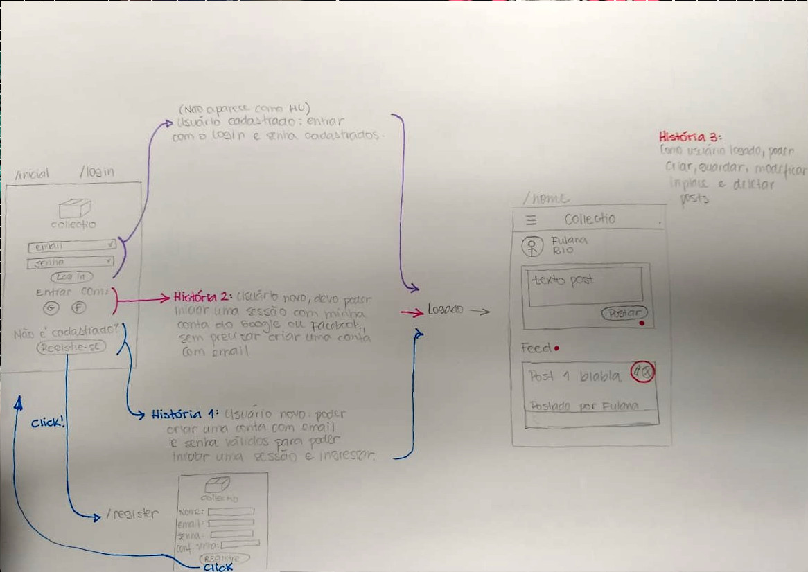
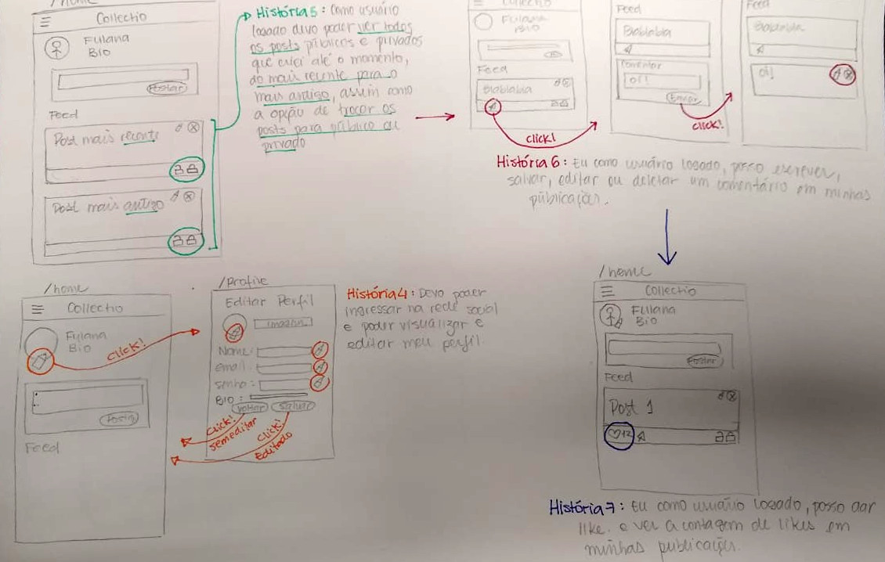

# PROJETO REDE SOCIAL - Collectio

## Por: Maria Carolina Rosatto, Katy Paiva e Tamiris Gonçalves

### 1. Definição do produto
Collectio é uma plataforma de socialização para colecionadores. A ideia é que qualquer colecionador possa compartilhar seus itens e combinar trocas, vendas ou somente conhecer a coleção de outras pessoas.

### 2. Funcionalidades
- Novos usuários podem se cadastrar na rede através de e-mail e senha, ou pelo login do Google;
- Usuários já cadastrados podem fazer login pelo Google ou pelo cadastro do próprio site;
- No feed de postagens, o usuário visualiza todas as postagens, tanto suas quanto de outras pessoas;
- Os posts podem ser de imagens ou texto;
- Os posts podem ser editados e deletados, de acordo com a necessidade do usuário, mantendo o dado atualizado no banco;
- O usuário pode ver somente suas postagens entrando na página Profile;
- Também é possível dar like nas postagens.

### 3. Protótipo de baixa fidelidade
Os protótipos das telas foram criados a partir das histórias de usuário. Relacionando as histórias, foram feitas as rotas.

 

 

### 4. Ferramentas utilizadas

1. Firebase & Firestore
2 .Vanilla JS
3. HTML 5
4. CSS
5. Git e GitHub
6. Visual Code Studio